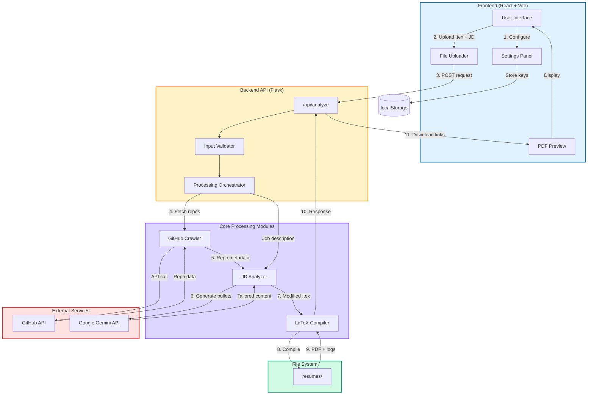

# Morphr

AI-powered resume tailoring backed by real GitHub data

---

## Table of Contents

- [Features](#features)
- [Tech Stack & Prerequisites](#tech-stack--prerequisites)
- [Architecture](#architecture)
- [Project Structure](#project-structure)
- [User Instructions](#user-instructions)
- [Developer Instructions](#developer-instructions)
- [Contributor Expectations](#contributor-expectations)
- [Known Issues](#known-issues)

---

## Features

| Feature | Description | Implementation |
|---------|-------------|----------------|
| **GitHub Grounding** | Maps job requirements to your repositories | Analyzes repos, READMEs, and code to generate verifiable bullets |
| **AI-Powered Rewrite** | Tailors resume bullets to job descriptions | Uses Google Gemini to extract skills and rewrite content |
| **LaTeX Compilation** | Produces ATS-friendly PDF resumes | Compiles modified `.tex` files via `pdflatex` or `tectonic` |
| **Privacy-First** | No credential storage on backend | API keys stored in browser `localStorage` only |

---

## Tech Stack & Prerequisites

### Stack

| Component | Technologies |
|-----------|-------------|
| **Frontend** | React, Vite, Tailwind CSS, Framer Motion, React-Three-Fiber |
| **Backend** | Python 3.9+, Flask, PyGithub, Google Generative AI SDK |
| **Compiler** | `pdflatex` or `tectonic` |

### Prerequisites

- Node.js 18+
- Python 3.9+
- LaTeX compiler (`pdflatex` or `tectonic`)
- Gemini API key
- GitHub personal access token

---

## Architecture



### Data Flow

1. User configures API keys in Settings (stored in browser)
2. User uploads base `.tex` resume and pastes job description
3. Frontend sends POST request to `/api/analyze` with credentials
4. Backend crawls GitHub repositories using provided token
5. JD Analyzer extracts skills and requirements from job description
6. Gemini API generates tailored resume bullets with GitHub evidence
7. LaTeX Compiler processes modified `.tex` file
8. System outputs PDF and compilation logs
9. Frontend receives download links for `.tex` and PDF files

---

## Project Structure

```
Morphr/
├── backend/
│   ├── resumes/              # Output directory for generated files
│   │   ├── amazon/           # Company-specific outputs
│   │   └── google/
│   ├── main.py               # Flask API entrypoint
│   ├── github_crawler.py     # GitHub API integration
│   ├── jd_analyzer.py        # Gemini-powered JD analysis
│   ├── compiler.py           # LaTeX compilation logic
│   ├── config.py             # Configuration management
│   ├── requirements.txt      # Python dependencies
│   └── .env.example          # Environment template
│
├── frontend/
│   ├── src/
│   │   ├── components/       # React components
│   │   ├── hooks/            # Custom React hooks
│   │   ├── pages/            # Page components
│   │   ├── App.jsx           # Main app component
│   │   └── main.jsx          # React entrypoint
│   ├── index.html
│   ├── package.json
│   ├── vite.config.js
│   └── tailwind.config.js
│
└── README.md
```

---

## User Instructions

### Backend Setup

```powershell
cd backend
python -m venv venv
venv\Scripts\activate
pip install -r requirements.txt
python main.py
```

Backend runs on `http://localhost:5000`

### Frontend Setup

```powershell
cd frontend
npm install
npm run dev
```

Frontend runs on `http://localhost:5173`

### Usage Workflow

| Step | Action |
|------|--------|
| 1 | Open web app and navigate to Settings |
| 2 | Enter Gemini API key and GitHub username/token |
| 3 | Upload your base LaTeX resume (`.tex` file) |
| 4 | Paste the job description in the text area |
| 5 | Click "Generate" and wait for processing |
| 6 | Download the tailored `.tex` and PDF files |

---

## Developer Instructions

### Backend Architecture

| Module | Purpose | Key Functions |
|--------|---------|---------------|
| `main.py` | API server and routing | `/api/analyze`, `/api/health` |
| `github_crawler.py` | Repository data extraction | `fetch_repos()`, `analyze_repo()` |
| `jd_analyzer.py` | AI-powered content generation | `extract_skills()`, `generate_bullets()` |
| `compiler.py` | LaTeX to PDF conversion | `compile_latex()`, `validate_output()` |

### Local Development

1. Create `.env` file in `backend/` (optional):
   ```
   GEMINI_API_KEY=your_key_here
   GITHUB_TOKEN=your_token_here
   ```

2. Run tests:
   ```powershell
   pytest backend/tests/
   ```

3. Frontend development:
   ```powershell
   npm run dev
   ```

### API Endpoints

| Endpoint | Method | Description |
|----------|--------|-------------|
| `/api/analyze` | POST | Process resume with JD and GitHub data |
| `/api/health` | GET | Health check |

---

## Contributor Expectations

| Area | Guidelines |
|------|-----------|
| **Pull Requests** | Small, focused changes with clear descriptions |
| **Testing** | Include unit tests for new backend logic |
| **UI/UX** | Maintain visual consistency and responsiveness |
| **Privacy** | Never persist user API keys or credentials |
| **Code Style** | Follow existing patterns and linting rules |

---

## Known Issues

| Issue | Impact | Workaround |
|-------|--------|------------|
| Large GitHub accounts | Increased processing time | Use fine-grained tokens with repo-only access |
| Complex LaTeX templates | Compilation failures | Check `backend/resumes/` logs for errors |
| GitHub rate limiting | API throttling | Authenticate with personal access token |
| Multi-page resumes | ATS compatibility issues | Ensure base template fits single page |

---

Made with 💗 by BlaZe
