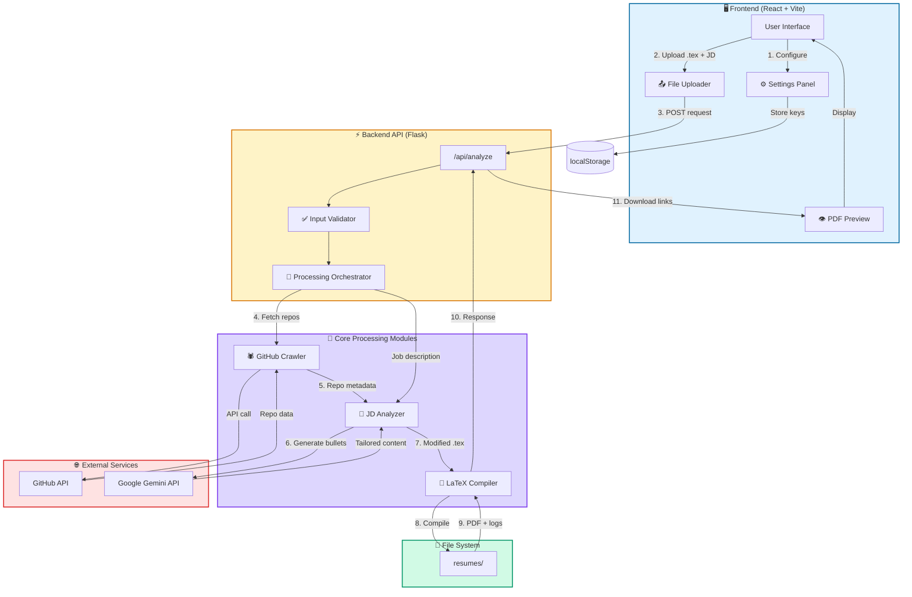

<div align="center">

# Morphr

### AI-powered resume tailoring backed by real GitHub data

[](https://www.python.org/)
[](https://reactjs.org/)
[](https://flask.palletsprojects.com/)
[](https://vitejs.dev/)

[](LICENSE)
[](CONTRIBUTING.md)

[Features](#-features) • [Quick Start](#-quick-start) • [Architecture](#-architecture) • [Documentation](#-documentation)

</div>

---

## 📋 Table of Contents

- [✨ Features](#-features)
- [🚀 Quick Start](#-quick-start)
- [🛠️ Tech Stack](#️-tech-stack)
- [🏗️ Architecture](#️-architecture)
- [📁 Project Structure](#-project-structure)
- [📖 User Guide](#-user-guide)
- [👨‍💻 Developer Guide](#-developer-guide)
- [🤝 Contributing](#-contributing)
- [⚠️ Known Issues](#️-known-issues)

---

## ✨ Features

<table>
<tr>
<td width="50%">

### 🔗 GitHub Grounding
Maps job requirements to your repositories by analyzing repos, READMEs, and code to generate verifiable bullets

</td>
<td width="50%">

### 🤖 AI-Powered Rewrite
Tailors resume bullets to job descriptions using Google Gemini to extract skills and rewrite content

</td>
</tr>
<tr>
<td width="50%">

### 📄 LaTeX Compilation
Produces ATS-friendly PDF resumes by compiling modified `.tex` files via `pdflatex` or `tectonic`

</td>
<td width="50%">

### 🔒 Privacy-First
No credential storage on backend - API keys stored in browser `localStorage` only

</td>
</tr>
</table>

---

## 🚀 Quick Start

### Prerequisites

```bash
Node.js 18+  |  Python 3.9+  |  LaTeX (pdflatex/tectonic)
```

### Installation

**Backend**
```powershell
cd backend
python -m venv venv
venv\Scripts\activate
pip install -r requirements.txt
python main.py
```
> 🌐 Backend runs on `http://localhost:8000`

**Frontend**
```powershell
cd frontend
npm install
npm run dev
```
> 🌐 Frontend runs on `http://localhost:5173`

---

## 🛠️ Tech Stack

<div align="center">

| Layer | Technologies |
|:-----:|:------------|
| **Frontend** |     |
| **Backend** |    |
| **AI/ML** |  |
| **Compiler** |  |

</div>

### Required API Keys

- 🔑 **Gemini API Key** - [Get it here](https://makersuite.google.com/app/apikey)
- 🔑 **GitHub Personal Access Token** - [Generate here](https://github.com/settings/tokens)

---

## 🏗️ Architecture



### 🔄 Data Flow

| Step | Process |
|:----:|:--------|
| **1** | User configures API keys in Settings (stored in browser) |
| **2** | User uploads base `.tex` resume and pastes job description |
| **3** | Frontend sends POST request to `/api/analyze` with credentials |
| **4** | Backend crawls GitHub repositories using provided token |
| **5** | JD Analyzer extracts skills and requirements from job description |
| **6** | Gemini API generates tailored resume bullets with GitHub evidence |
| **7** | LaTeX Compiler processes modified `.tex` file |
| **8** | System outputs PDF and compilation logs |
| **9** | Frontend receives download links for `.tex` and PDF files |

---

## 📁 Project Structure

```
Morphr/
├── 🔧 backend/
│   ├── 📂 resumes/              # Output directory for generated files
│   │   ├── amazon/              # Company-specific outputs
│   │   └── google/
│   ├── 🚀 main.py               # Flask API entrypoint
│   ├── 🕷️ github_crawler.py     # GitHub API integration
│   ├── 🧠 jd_analyzer.py        # Gemini-powered JD analysis
│   ├── 📝 compiler.py           # LaTeX compilation logic
│   ├── ⚙️ config.py             # Configuration management
│   ├── 📦 requirements.txt      # Python dependencies
│   └── 📄 .env.example          # Environment template
│
├── 🎨 frontend/
│   ├── 📂 src/
│   │   ├── components/          # React components
│   │   ├── hooks/               # Custom React hooks
│   │   ├── pages/               # Page components
│   │   ├── App.jsx              # Main app component
│   │   └── main.jsx             # React entrypoint
│   ├── 🌐 index.html
│   ├── 📦 package.json
│   ├── ⚡ vite.config.js
│   └── 🎨 tailwind.config.js
│
└── 📖 README.md
```

---

## 📖 User Guide

### 🎯 Usage Workflow

<div align="center">

| Step | Action | Details |
|:----:|:-------|:--------|
| **1** | 🔧 **Configure Settings** | Open web app → Navigate to Settings |
| **2** | 🔑 **Add Credentials** | Enter Gemini API key and GitHub username/token |
| **3** | 📤 **Upload Resume** | Upload your base LaTeX resume (`.tex` file) |
| **4** | 📋 **Paste Job Description** | Paste the job description in the text area |
| **5** | ⚡ **Generate** | Click "Generate" and wait for processing |
| **6** | 📥 **Download** | Download the tailored `.tex` and PDF files |

</div>
---

## 👨‍💻 Developer Guide

### 🏗️ Backend Architecture

| Module | Purpose | Key Functions |
|:-------|:--------|:--------------|
| `main.py` | API server and routing | `/api/analyze`, `/api/health`, `/ping` |
| `github_crawler.py` | Repository data extraction | `fetch_repos()`, `analyze_repo()` |
| `jd_analyzer.py` | AI-powered content generation | `extract_skills()`, `generate_bullets()` |
| `compiler.py` | LaTeX to PDF conversion | `compile_latex()`, `validate_output()` |

### 🔧 Local Development

**1. Environment Setup**

Create `.env` file in `backend/` (optional):
```env
GEMINI_API_KEY=your_key_here
GITHUB_TOKEN=your_token_here
```

**2. Run Tests**
```powershell
pytest backend/tests/
```

**3. Frontend Development**
```powershell
npm run dev
```

### 🌐 API Endpoints

| Endpoint | Method | Description | Status |
|:---------|:------:|:------------|:------:|
| `/api/analyze` | POST | Process resume with JD and GitHub data | ✅ |
| `/api/health` | GET | Health check with service validation | ✅ |
| `/ping` | GET | Simple uptime monitoring | ✅ |
| `/api/projects` | GET | Fetch GitHub projects | ✅ |
| `/api/upload-resume` | POST | Upload base resume | ✅ |
| `/api/download/<folder>/<file>` | GET | Download generated files | ✅ |
| `/api/history` | GET | Get generation history | ✅ |

---

## 🤝 Contributing

We welcome contributions! Please follow these guidelines:

<table>
<tr>
<td width="50%">

### 📝 Pull Requests
- Small, focused changes
- Clear descriptions
- Link related issues

</td>
<td width="50%">

### 🧪 Testing
- Include unit tests
- Test edge cases
- Maintain coverage

</td>
</tr>
<tr>
<td width="50%">

### 🎨 UI/UX
- Visual consistency
- Responsive design
- Accessibility compliance

</td>
<td width="50%">

### 🔒 Privacy
- No credential persistence
- Secure data handling
- Follow best practices

</td>
</tr>
</table>

---

## ⚠️ Known Issues

| Issue | Impact | Workaround |
|:------|:------:|:-----------|
| 🐌 Large GitHub accounts | Increased processing time | Use fine-grained tokens with repo-only access |
| 📄 Complex LaTeX templates | Compilation failures | Check `backend/resumes/` logs for errors |
| ⏱️ GitHub rate limiting | API throttling | Authenticate with personal access token |
| 📑 Multi-page resumes | ATS compatibility issues | Ensure base template fits single page |

---

<div align="center">

### Made with 💗 by [BlaZe](https://github.com/BlaZe)

</div>
